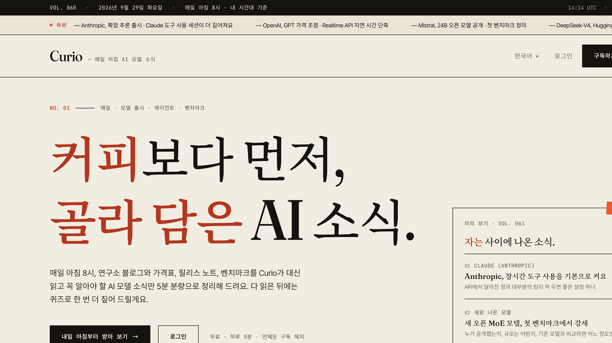
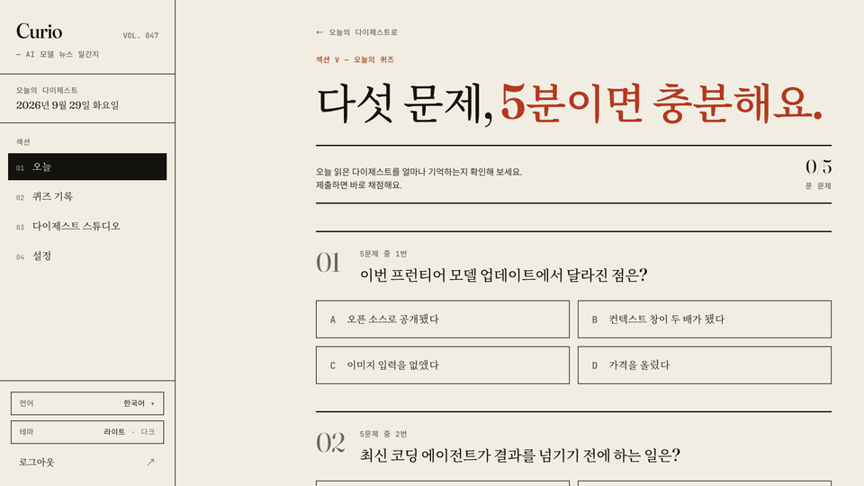
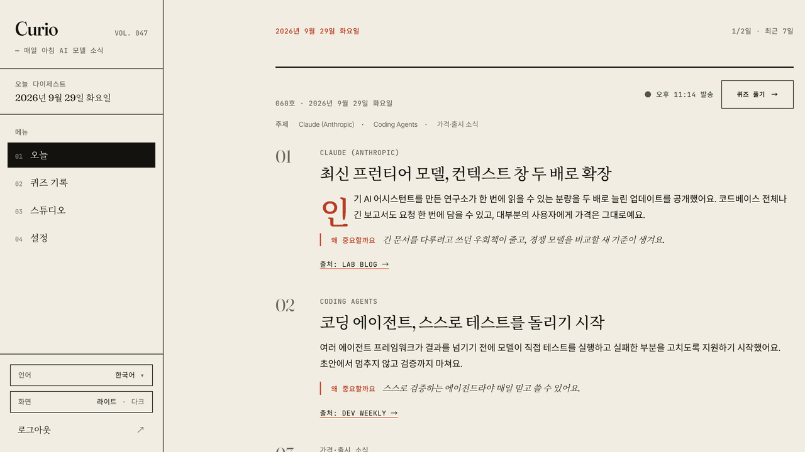
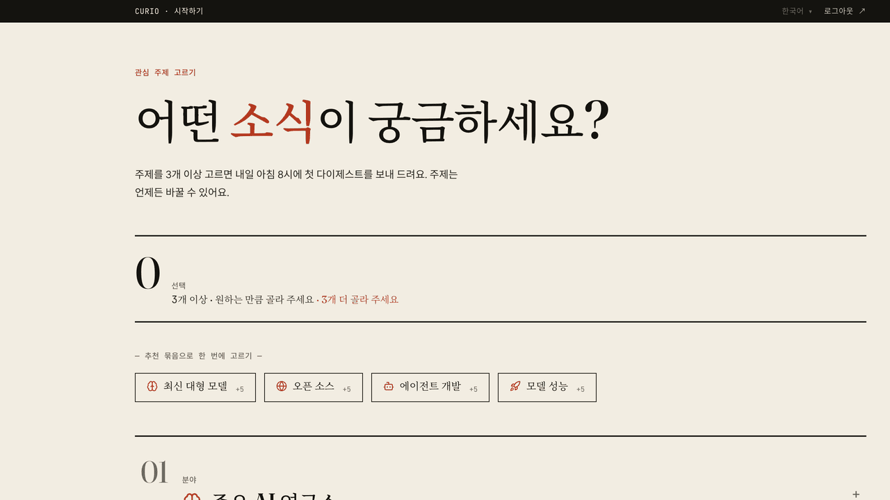
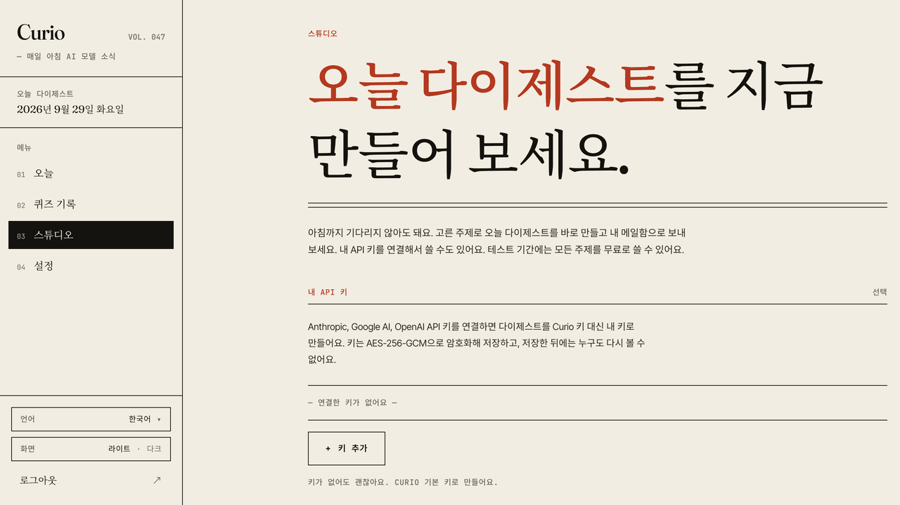
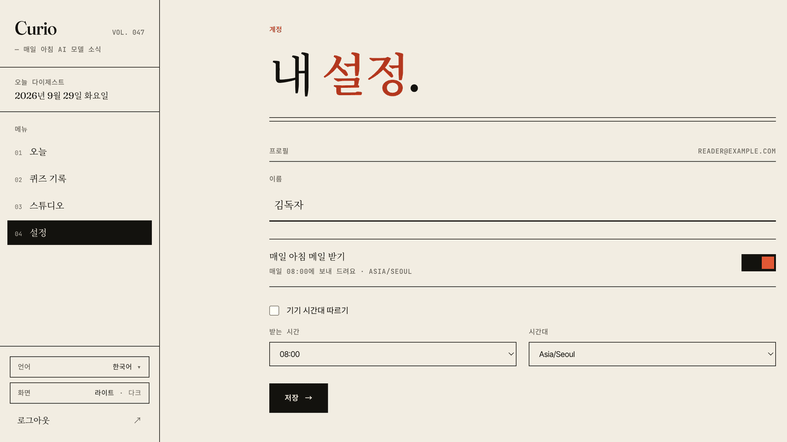
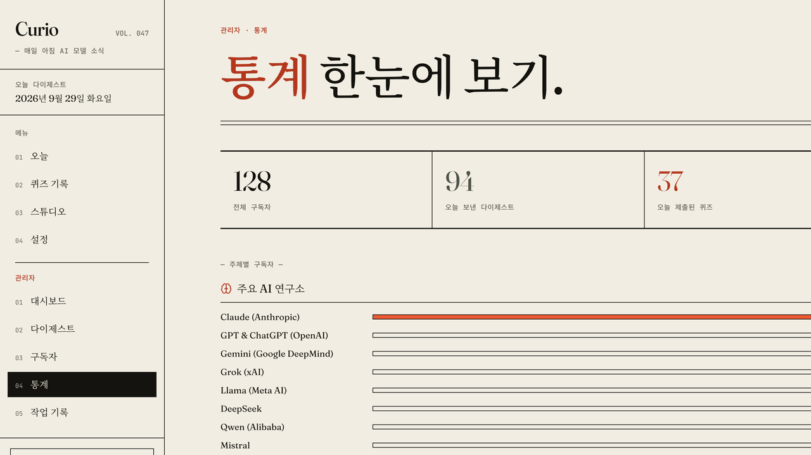

# Curio

[English](README.md) · **한국어**

**매일 아침 AI 모델 소식을 골라 전해 드려요. 퀴즈 5문제로 읽은 내용을 오래 기억할 수 있어요.**

Curio는 Anthropic, OpenAI, DeepMind, Meta AI, Mistral, Hugging Face 같은 연구소의 공식 블로그와 NewsAPI에서 기사를 모아요. 그중 내가 고른 주제만 Claude가 쉬운 말로 요약해서, 내 시간대에 맞춰 정한 시간에 메일로 보내 드려요. 다 읽고 나면 퀴즈로 얼마나 기억하는지 확인해 보세요.



## 이렇게 써요

1. **주제 고르기**: 최신 모델, 코딩 에이전트, 가격, 벤치마크 등 AI 모델 주제 18개 중 3개 이상 골라요.
2. **아침 다이제스트 읽기**: 소식은 최대 8개예요. 소식마다 제목, 50~80단어 요약, '왜 중요할까요'가 붙고, 웹과 메일에서 모두 읽을 수 있어요.
3. **퀴즈 풀기**: 오늘 다이제스트로 만든 5문제를 풀면 바로 채점하고 해설을 보여 드려요.



## 화면

| 오늘 다이제스트 | 주제 고르기 |
|---|---|
|  |  |
| **스튜디오**: 원할 때 바로 만들고 보내기 | **영어판**: 화면과 AI 콘텐츠 모두 영어 |
|  |  |
| **설정**: 받는 시간과 시간대 | **관리자**: 구독자, 다이제스트, 예약 작업, 작업 기록 |
|  |  |

<sub>스크린샷은 샘플 데이터로 찍었어요.</sub>

## 주요 기능

- **맞춤 다이제스트**: 고른 주제에서 소식을 고루 뽑아, 내 시간대 기준으로 정한 시간에 보내 드려요.
- **복습 퀴즈**: 다이제스트마다 5문제를 서버에서 채점하고 기록을 남겨요. 다시 풀면 더 높은 점수가 남아요.
- **English · 한국어**: 모든 화면을 두 언어로 쓸 수 있어요. 언어를 바꾸면 AI가 쓰는 다이제스트, 퀴즈, 메일 언어도 함께 바뀌어요.
- **내 API 키 사용**: 내 Claude, Gemini, OpenAI 키로 다이제스트를 만들 수 있어요. 키는 암호화해서 저장해요.
- **스튜디오**: 오늘 다이제스트를 직접 만들고 메일로 보내면서 진행 상황을 바로 확인해요.
- **관리자 대시보드**: 구독자, 다이제스트, 주제별 통계, 예약 작업 상태와 수동 실행, 작업 기록을 한곳에서 봐요.
- **안전한 로그인**: 비밀번호를 입력한 뒤 메일로 받은 6자리 코드로 한 번 더 확인해요. Google 로그인도 쓸 수 있어요.

## 기술 스택

| | |
|---|---|
| **프론트엔드** | Vue 3 · TypeScript · Vite · Pinia · Tailwind CSS v4 · vue-i18n |
| **백엔드** | Java 21 · Spring Boot 3.5 · PostgreSQL 16 · Redis 7 · Flyway |
| **AI·외부 서비스** | Claude(기본) / Gemini / OpenAI · NewsAPI · Resend |

버전과 전체 스택은 [`docs/CODEBASE.md`](docs/CODEBASE.md#technology-stack)에서 볼 수 있어요.

## 빠르게 시작하기

Java 21, Maven 3.9 이상, Node.js 20 이상, Docker가 필요해요.

```bash
# 1. Postgres + Redis
cp .env.dev.example .env.dev
docker compose --env-file .env.dev -f docker-compose.infra.yml up -d

# 2. 백엔드 → http://localhost:8080
cd backend && cp .env.example .env    # CLAUDE_API_KEY, RESEND_API_KEY, NEWS_API_KEY 입력
mvn spring-boot:run -Dspring-boot.run.profiles=dev

# 3. 프론트엔드 → http://localhost:5173
cd frontend && npm install && npm run dev
```

> 백엔드는 꼭 `dev` 프로필로 실행해 주세요. 프로필 없이 `mvn spring-boot:run`만 실행하면 운영용 `prod` 프로필로 시작해서, 실제 시크릿이 없으면 바로 멈춰요.

전체 설치 과정과 문제 해결은 [`docs/SETUP.md`](docs/SETUP.md), API 키 발급 방법은 [`docs/SETUP_API_KEYS.md`](docs/SETUP_API_KEYS.md)를 확인해 주세요.

## 저장소 구성

```
curio/
├── frontend/   Vue 3 SPA              → frontend/README.md
├── backend/    Spring Boot REST API   → backend/README.md
├── docs/       설치, 구조, 레퍼런스, 배포 문서
└── scripts/    백업·복원, 배포, k6 부하 테스트
```

## 문서

`docs/`의 자세한 문서는 영어로 쓰여 있어요.

| 문서 | 이럴 때 읽어 보세요 |
|---|---|
| [SETUP.md](docs/SETUP.md) | 내 컴퓨터에서 실행하거나 설치 문제를 해결할 때 |
| [ARCHITECTURE.md](docs/ARCHITECTURE.md) | 시스템 구조와 데이터 흐름, 기능이 동작하는 방식이 궁금할 때 |
| [CODEBASE.md](docs/CODEBASE.md) | API, 테이블, 마이그레이션, 컴포넌트, 테스트를 찾을 때 |
| [ENV_VARIABLES.md](docs/ENV_VARIABLES.md) | 환경 변수가 하는 일을 알고 싶을 때 |
| [DEPLOY.md](docs/DEPLOY.md) | Docker Compose와 TLS로 운영 서버에 배포할 때 |

## 기여하기

브랜치·커밋 규칙, PR 전에 돌려야 할 검사, 코드 규칙은 [`CONTRIBUTING.md`](./CONTRIBUTING.md)에 있어요. 보안 문제는 공개 이슈 대신 [`SECURITY.md`](./SECURITY.md)에 안내된 방법으로 알려 주세요.

## 라이선스

Proprietary
