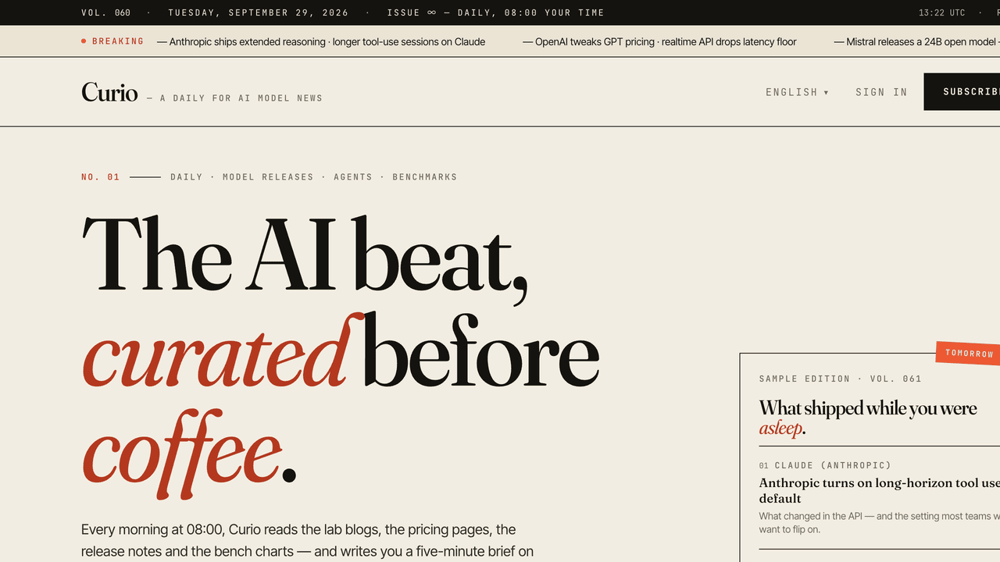
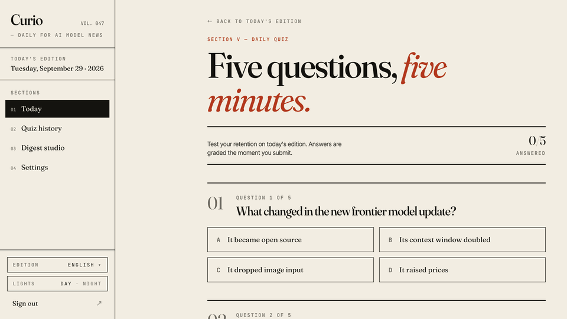
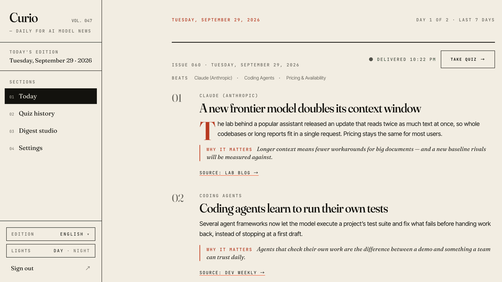
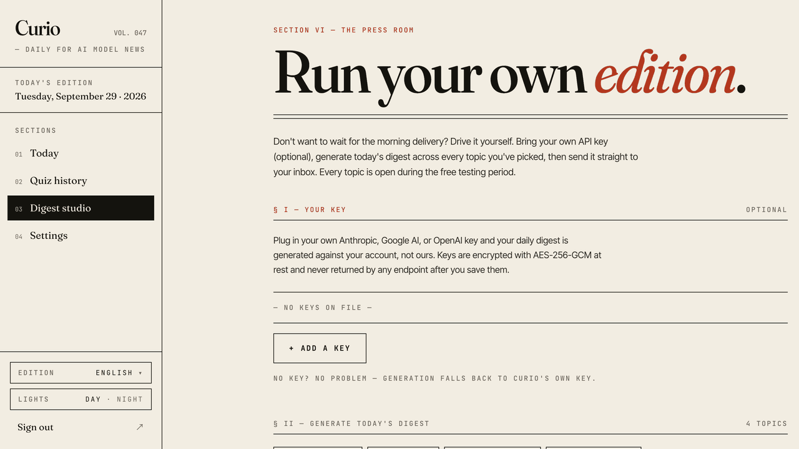
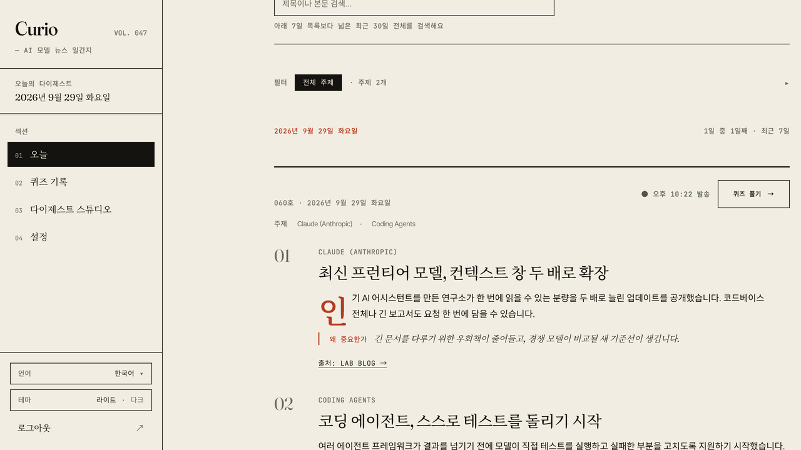
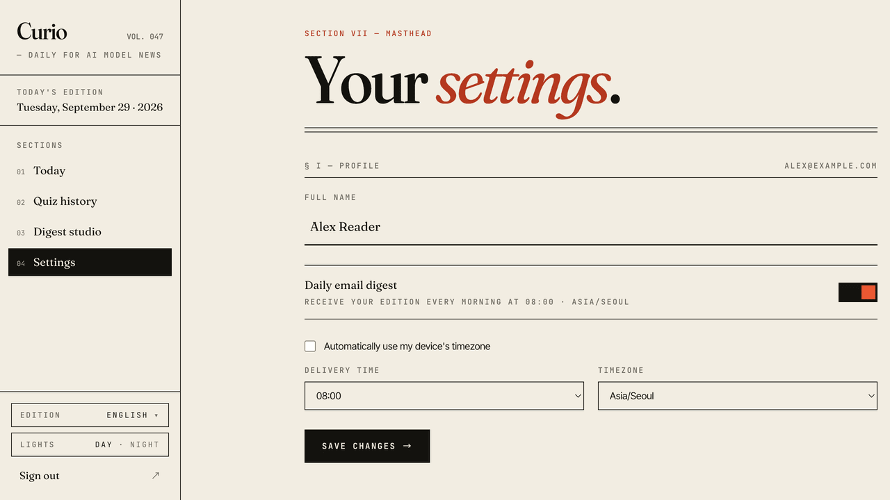
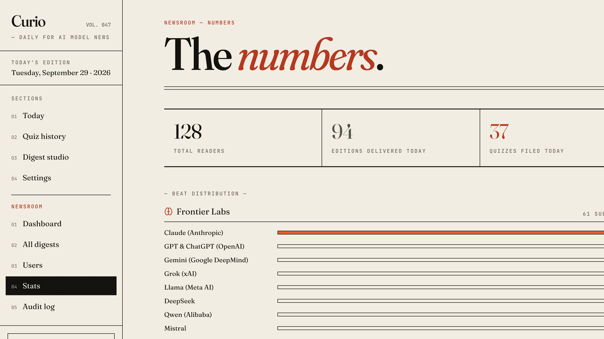

# Curio

**English** · [한국어](README.ko.md)

**A daily, AI-curated brief on AI model news — with a five-question quiz so it actually sticks.**

Curio reads first-party lab blogs (Anthropic, OpenAI, DeepMind, Meta AI, Mistral, Hugging Face) plus NewsAPI, has Claude write plain-language summaries of the topics you picked, and emails you the issue at your local delivery hour. Then it quizzes you on what you read.



## How it works

1. **Pick your beats** — choose 3+ of 18 model-centric topics (frontier labs, coding agents, pricing, benchmarks, …).
2. **Read the morning edition** — up to 8 stories, each a headline, a 50–80 word TL;DR, and "why it matters", on the web and by email.
3. **Take the quiz** — five questions on today's issue, graded instantly with explanations.



## Screens

| Today's edition | Topic picker |
|---|---|
|  |  |
| **Digest Studio** — generate and send on demand | **한국어 edition** — UI and AI content in Korean |
|  |  |
| **Settings** — delivery hour and timezone | **Newsroom (admin)** — readers, digests, jobs, audit log |
|  |  |

<sub>Screenshots use sample data.</sub>

## Features

- **Personalized daily digest** — stories round-robined across your topics, delivered at your chosen hour in your timezone.
- **Retention quizzes** — five questions per digest, server-side scoring, quiz history; a retake keeps your best score.
- **English · 한국어** — every page in both editions; your edition also sets the language the AI writes in.
- **Bring your own key** — run your digests on your own Claude, Gemini or OpenAI key (encrypted at rest).
- **Digest Studio** — generate today's digest and send the email yourself, with live progress.
- **Newsroom dashboard** — readers, digests, topic stats, scheduled-job status with manual triggers, audit log.
- **Secure sign-in** — email + password with an emailed 6-digit code, or Google.

## Tech stack

| | |
|---|---|
| **Frontend** | Vue 3 · TypeScript · Vite · Pinia · Tailwind CSS v4 · vue-i18n |
| **Backend** | Java 21 · Spring Boot 3.5 · PostgreSQL 16 · Redis 7 · Flyway |
| **AI & services** | Claude (default) / Gemini / OpenAI · NewsAPI · Resend |

Versions and the rest of the stack: [`docs/CODEBASE.md`](docs/CODEBASE.md#technology-stack).

## Quick start

Needs Java 21, Maven 3.9+, Node.js 20+, and Docker.

```bash
# 1. Postgres + Redis
cp .env.dev.example .env.dev
docker compose --env-file .env.dev -f docker-compose.infra.yml up -d

# 2. Backend → http://localhost:8080
cd backend && cp .env.example .env    # add CLAUDE_API_KEY, RESEND_API_KEY, NEWS_API_KEY
mvn spring-boot:run -Dspring-boot.run.profiles=dev

# 3. Frontend → http://localhost:5173
cd frontend && npm install && npm run dev
```

> Always pass the `dev` profile — a bare `mvn spring-boot:run` boots the fail-fast `prod` profile.

Full walkthrough and troubleshooting: [`docs/SETUP.md`](docs/SETUP.md). Where to get each API key: [`docs/SETUP_API_KEYS.md`](docs/SETUP_API_KEYS.md).

## Repository layout

```
curio/
├── frontend/   Vue 3 SPA              → frontend/README.md
├── backend/    Spring Boot REST API   → backend/README.md
├── docs/       Setup, architecture, reference, deploy
└── scripts/    Backup/restore, deploy, k6 load tests
```

## Documentation

| Doc | Read it when you want to… |
|---|---|
| [SETUP.md](docs/SETUP.md) | run Curio locally, or fix a local setup problem |
| [ARCHITECTURE.md](docs/ARCHITECTURE.md) | understand the system, data flows and feature internals |
| [CODEBASE.md](docs/CODEBASE.md) | look up an endpoint, table, migration, component or test |
| [ENV_VARIABLES.md](docs/ENV_VARIABLES.md) | find what an environment variable does |
| [DEPLOY.md](docs/DEPLOY.md) | deploy to production with Docker Compose + TLS |

## Contributing

See [`CONTRIBUTING.md`](./CONTRIBUTING.md) for branch and commit conventions, the checks to run before a PR, and code conventions. Report security issues privately per [`SECURITY.md`](./SECURITY.md).

## License

Proprietary
