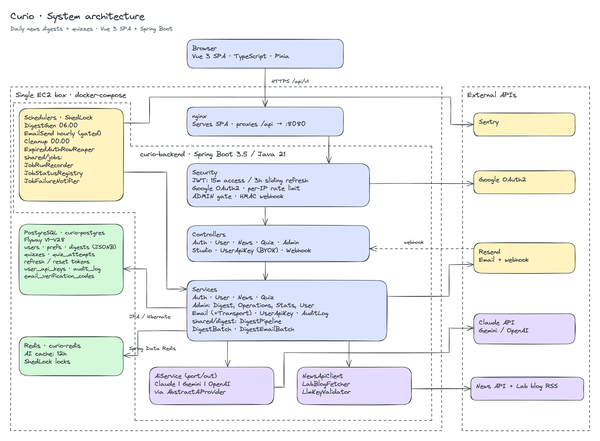
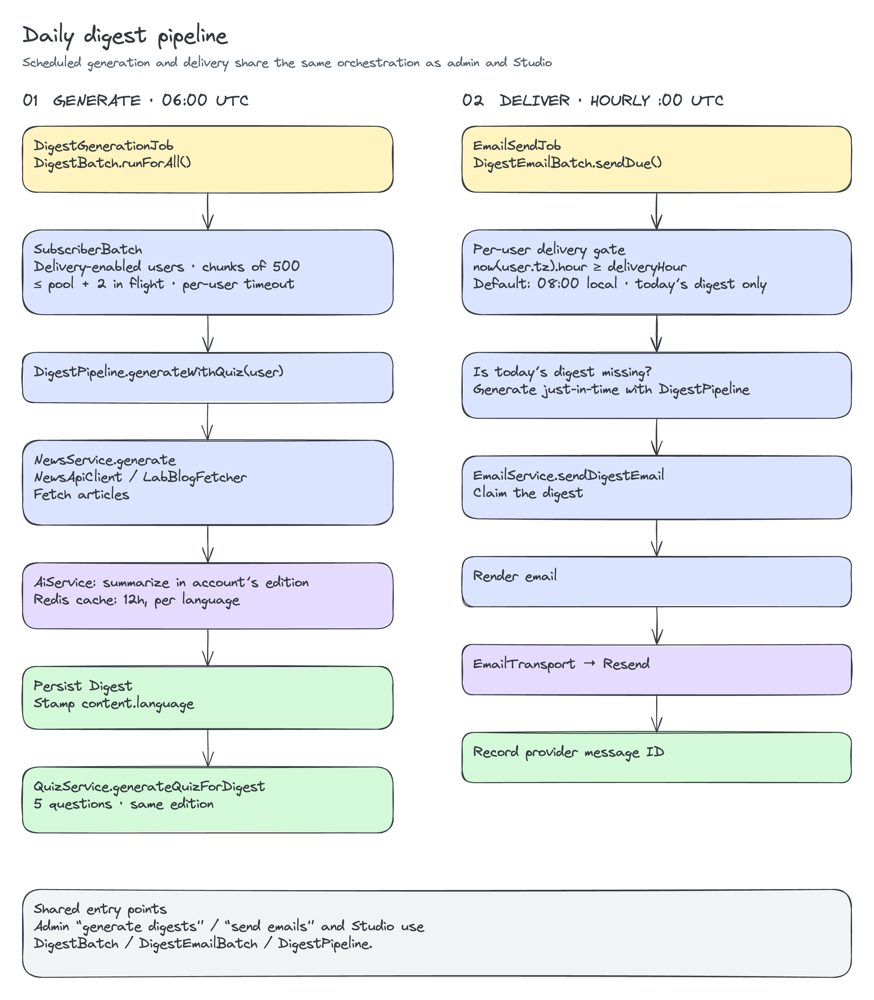
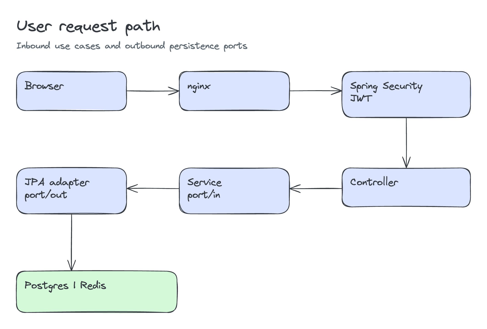
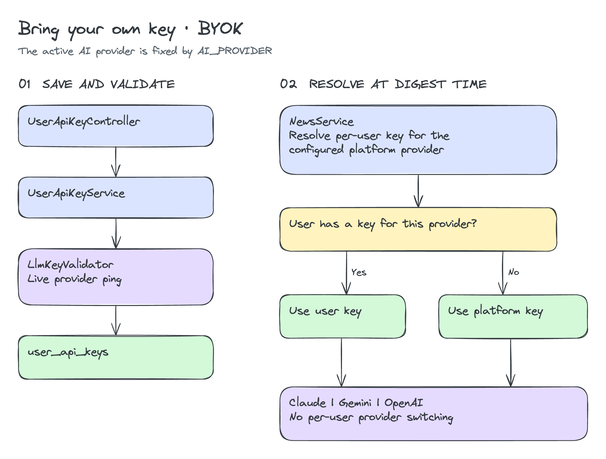
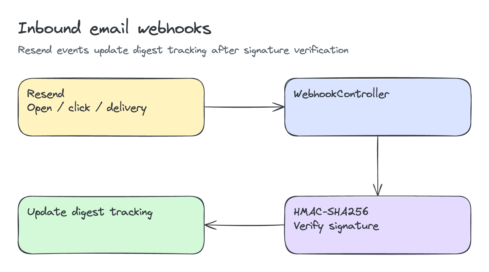

# Curio — System Architecture

_AI-powered personalized news service: daily digests tailored to user interests, with built-in quizzes for retention. Vue 3 SPA frontend + Spring Boot backend._

> Reflects the implementation as of 2026-07-11 (post Stripe removal, multi-provider AI, BYOK, production hardening, email-login 2FA, digest unique constraint, quiz better-score-wins, timezone auto-follow).

## Diagram

[Edit in Excalidraw](diagrams/system-architecture.excalidraw)

## Core data flows

### 1. Daily digest pipeline (scheduled)

[Edit in Excalidraw](diagrams/daily-digest-pipeline.excalidraw)

### 2. Request path (user)

[Edit in Excalidraw](diagrams/user-request-path.excalidraw)

### 3. BYOK (bring-your-own-key)

[Edit in Excalidraw](diagrams/byok-flow.excalidraw)

### 4. Inbound webhooks

[Edit in Excalidraw](diagrams/inbound-webhooks.excalidraw)

## Feature internals

- **Content pipeline** — one `DigestPipeline` (digest + quiz per user) behind `DigestBatch` / `DigestEmailBatch`. It is driven by `DigestGenerationJob` (05:00 Asia/Seoul, once per **digest day** — `shared/time/DigestDay`), the hourly `EmailSendJob` (per-user delivery hour + IANA timezone, default 06:00; each reader gets the digest day that was current at their delivery hour, once per local day; catch-up gate, claim-before-send), the admin triggers and Studio. `CleanupJob` (00:00 UTC, 30-day retention) and `ExpiredAuthRowReaper` round it out; all jobs are ShedLock-coordinated. A digest is capped at 8 stories, round-robin across the user's topics.
- **Topics** — 18 model-centric leaf topics across four domains (Frontier Labs · Agentic & Developer Tools · Capabilities & Ecosystem · Emerging), shown as a 3-level accordion. Canonical ids live in `frontend/src/data/topics.ts` and `TopicConstants.java`.
- **Editions (EN / KO)** — the UI ships in both languages (vue-i18n). The account's `user_preferences.language` also sets the language the AI writes the digest, quiz and email in; the summary cache key includes the language, so editions never share content.
- **Auth** — email/password login is two-step (password → emailed 6-digit code, toggle `AUTH_EMAIL_VERIFICATION_ENABLED`); Google sign-in is a single-step ID-token flow. JWT access tokens (15 min) live in memory; the refresh token is an httpOnly, SHA-256-hashed cookie with single-use rotation and a 3-hour sliding idle timeout. Password change and reset revoke every session.
- **BYOK** — users can plug in their own Claude / Gemini / OpenAI key for the platform's configured provider. Keys are AES-256-GCM encrypted at rest, never returned by any API (masked preview only), gated behind password re-auth, and live-validated before storage. BYOK calls bypass the shared cache.
- **Email** — Resend-backed teaser digest with open/click tracking via HMAC-verified webhooks; one-click unsubscribe uses an HMAC-signed token with a two-step (GET confirm → POST) flow.
- **Reliability** — Resilience4j circuit breaker + bulkhead (max 4 concurrent) and in-process retry with backoff around AI calls; summaries cached in Redis (12 h TTL, `news:summaries:{topic}:{date}:{lang}`) with single-flight generation.
- **Security** — token/code hashing, HMAC webhook + unsubscribe signatures, per-IP rate limiting, CSP/HSTS, allowlisted Redis deserialization, scheme-allowlisted AI source links. Wrong API paths return JSON 404, not 500.

## Backend structure (hexagonal)

Each feature package (`auth`, `user`, `news`, `quiz`, `admin`, `studio`, `shared`) follows:

- `controller/` — REST endpoints (`/api/v1`)
- `port/in/` — inbound ports (use-case interfaces)
- `service/` — business logic implementing inbound ports
- `port/out/` — outbound ports (dependency abstractions)
- `adapter/persistence/` — JPA adapters implementing outbound ports
- `entity/`, `dto/`, `repository/`

AI is provider-agnostic: the `AiService` outbound port (`news/port/out`) with `ClaudeService` (default), `GeminiService`, `OpenAiService`, selected by the `AI_PROVIDER` env var. All three extend `AbstractAiProvider`, which owns caching, single-flight, retry, the circuit breaker/bulkhead and the shared prompts; a provider contributes only its wire format (and, for Claude, `supportsWebSearch()`).

The self-serve **Studio** (`studio/` package) lets a signed-in user manually trigger their own digest generation and email send on demand — `POST /api/v1/studio/generate`, `POST /api/v1/studio/send-email`, `GET /api/v1/studio/status` — independent of the scheduled jobs. `StudioTaskStatusService` tracks the async task state so the UI can poll progress.

## Current-state caveats

- **No Stripe / subscriptions** — removed 2026-06-21 (`V22__drop_subscriptions.sql` drops the table); all features unlocked for everyone.
- **BYOK** now works for all three providers (Claude, Gemini, OpenAI) — verified in an internal hardening audit.
- **Custom delivery-hour + IANA timezone** (V20) are now wired end-to-end — the Settings UI persists delivery-hour and timezone selects (`/user/preferences` carries `timezone` + `deliveryHour`; default 06:00 in the fallback zone, Asia/Seoul, when unset). **Full-text search** (V21) is wired in ArchiveView with debounced 300ms search over the full 30-day archive. **Audit log** (V18) has a dedicated UI at `/admin/audit` (AuditLogView) with paginated admin action history.
- **Single t3.micro EC2** runs the whole stack (nginx + backend + Postgres + Redis via docker-compose). DB backup/restore scripts (`scripts/pg_backup.sh`, `scripts/db_restore.sh`) and a TLS-enforcing deploy script (`scripts/deploy-prod.sh`, Caddy overlay) now exist; remaining operational gaps are tracked in an internal hardening audit.

> A production-readiness audit (2026-06-22) and the resulting fixes are recorded in an
> internal hardening audit. The architecture itself was found
> sound — the work was targeted hardening, not a redesign.
