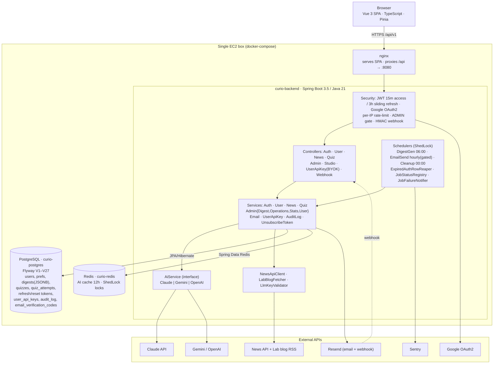

# Curio — System Architecture

_AI-powered personalized news service: daily digests tailored to user interests, with built-in quizzes for retention. Vue 3 SPA frontend + Spring Boot backend._

> Reflects the implementation as of 2026-07-11 (post Stripe removal, multi-provider AI, BYOK, production hardening, email-login 2FA, digest unique constraint, quiz better-score-wins, timezone auto-follow).

## Diagram



## Core data flows

### 1. Daily digest pipeline (scheduled)

```
DigestGenerationJob @06:00 UTC
  -> per delivery-enabled user: NewsService.generateDigestForUser
       -> NewsApiClient / LabBlogFetcher fetch articles
       -> AiService (Claude) summarize          [Redis cache 12h]
       -> QuizService.generateQuizForDigest     (5 questions)
       -> persist Digest + Quiz (Postgres)
EmailSendJob @hourly :00 UTC
  -> per-user gate: now(user.tz).hour == deliveryHour (default 08:00 UTC)
       -> EmailService.sendDigestEmail -> Resend -> mark email_sent_at
```

### 2. Request path (user)

```
Browser -> nginx -> Spring Security (JWT) -> Controller
        -> Service (port/in) -> JPA adapter (port/out) -> Postgres | Redis
```

### 3. BYOK (bring-your-own-key)

```
UserApiKeyController -> UserApiKeyService -> LlmKeyValidator (live ping) -> user_api_keys
NewsService resolves the per-user key at digest time for the platform's configured
  provider (Claude | Gemini | OpenAI); falls back to the platform key if the user has none.
  No per-user provider switching — the active provider is fixed by AI_PROVIDER.
```

### 4. Inbound webhooks

```
Resend (open/click/delivery) -> WebhookController -> HMAC-SHA256 verify -> update digest tracking
```

## Backend structure (hexagonal)

Each feature package (`auth`, `user`, `news`, `quiz`, `admin`, `studio`, `shared`) follows:

- `controller/` — REST endpoints (`/api/v1`)
- `port/in/` — inbound ports (use-case interfaces)
- `service/` — business logic implementing inbound ports
- `port/out/` — outbound ports (dependency abstractions)
- `adapter/persistence/` — JPA adapters implementing outbound ports
- `entity/`, `dto/`, `repository/`

AI is provider-agnostic: `AiService` interface with `ClaudeService` (default), `GeminiService`, `OpenAiService`, selected by the `AI_PROVIDER` env var.

The self-serve **Studio** (`studio/` package) lets a signed-in user manually trigger their own digest generation and email send on demand — `POST /api/v1/studio/generate`, `POST /api/v1/studio/send-email`, `GET /api/v1/studio/status` — independent of the scheduled jobs. `StudioTaskStatusService` tracks the async task state so the UI can poll progress.

## Current-state caveats

- **No Stripe / subscriptions** — removed 2026-06-21 (`V22__drop_subscriptions.sql` drops the table); all features unlocked for everyone.
- **BYOK** now works for all three providers (Claude, Gemini, OpenAI) — verified in an internal hardening audit.
- **Custom delivery-hour + IANA timezone** (V20) are now wired end-to-end — the Settings UI persists delivery-hour and timezone selects (`/user/preferences` carries `timezone` + `deliveryHour`; default 08:00 UTC when unset). **Full-text search** (V21) is wired in ArchiveView with debounced 300ms search over the full 30-day archive. **Audit log** (V18) has a dedicated UI at `/admin/audit` (AuditLogView) with paginated admin action history.
- **Single t3.micro EC2** runs the whole stack (nginx + backend + Postgres + Redis via docker-compose). DB backup/restore scripts (`scripts/pg_backup.sh`, `scripts/db_restore.sh`) and a TLS-enforcing deploy script (`scripts/deploy-prod.sh`, Caddy overlay) now exist; remaining operational gaps are tracked in an internal hardening audit.

> A production-readiness audit (2026-06-22) and the resulting fixes are recorded in an
> internal hardening audit. The architecture itself was found
> sound — the work was targeted hardening, not a redesign.
